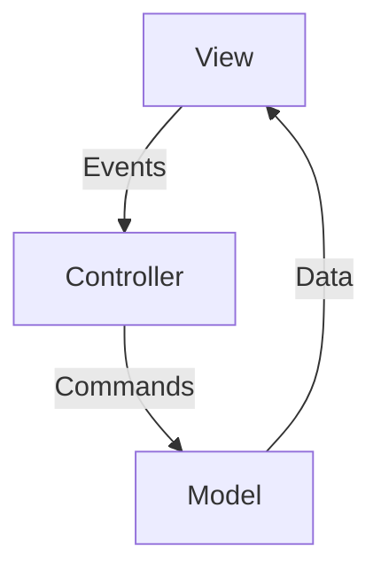

# **Wallpaper Manager - Advanced Java Project**

## **Project Highlights**
### 🖥️ **Complex Swing GUI**
- **Custom-styled components**  
  Gradient buttons, rounded frames, and dynamic layouts for modern UI.
- **Multi-panel navigation**  
  Seamless transitions (home screen → wallpaper selection).
- **Undecorated windows**  
  Custom title bars with minimize/exit controls.
- **Asynchronous operations**  
  `SwingWorker` for background tasks without UI freezing.

### 🔗 **System Integration**
- **PowerShell automation**  
  Changes Windows wallpapers via scripts.
- **File system management**  
  Load/move/delete wallpapers with robust error handling.

### 🏗️ **Architecture**

- **MVC-like separation**  
  Clear division between UI (`View`), logic (`Controller`), and data (`Model`).
- **Modular components**  
  Reusable modules:
    - `ColorProvider` (day-based theming)
    - `WallpaperManager` (file operations)
    - `WallpaperSetter` (PowerShell integration)

### 🌈 **Dynamic Features**
- **Day-based theming**  
  Colors, deities, and mantras change daily.
- **Smart image processing**
    - Auto-scaling wallpapers
    - Color-based grouping (K-Means/Median Cut)

### 🛡️ **Robustness**
- **Thread-safe UI**  
  `SwingWorker` ensures safe background updates.
- **Error handling**  
  Graceful fallbacks for file/PowerShell failures.

### 🎨 **Custom Graphics**
```java
// Example: Gradient button
g2d.setPaint(new GradientPaint(0, 0, Color.PINK, width, height, Color.VIOLET));
g2d.fillRoundRect(0, 0, width, height, 20, 20);
```
- Rounded corners
- Dynamic resizing
- Smooth gradients
---

## **How to Extend**
1. **Add new algorithms**  
   Implement `ColorAnalyzer` interface:
   ```java
   public class NewAnalyzer implements ColorAnalyzer {
       @Override
       public Map<String, Double> analyze(String imagePath, int numColors) {
           // Your logic
       }
   }
   ```
2. **Modify themes**  
   Edit `ColorProvider.java` for daily colors.

---
---

**Tip**: Run with `mvn exec:java` and enjoy 60 FPS animations!

--- 

This format:
1. **Showcases complexity** without overwhelming readers
2. Uses **visual cues** (Mermaid diagrams, code snippets)
3. **Highlights extensibility** for developers
